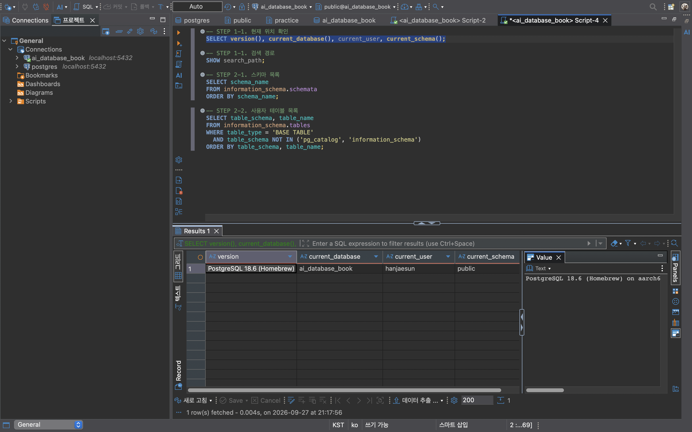
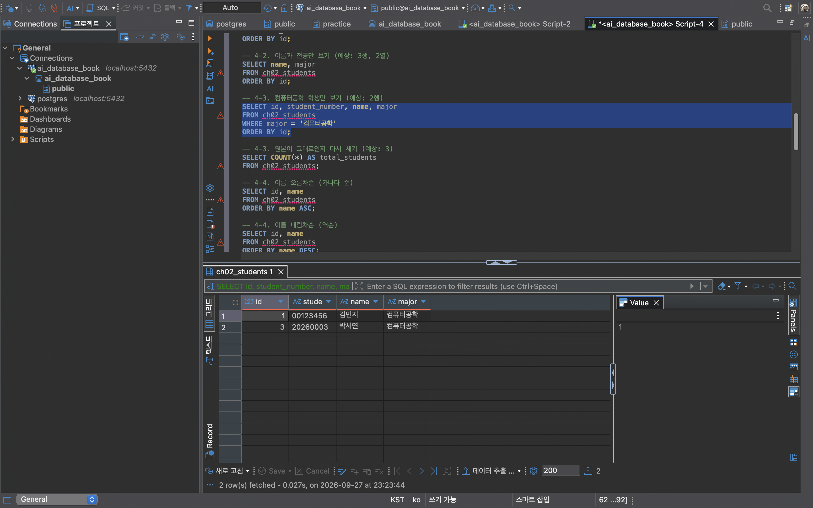
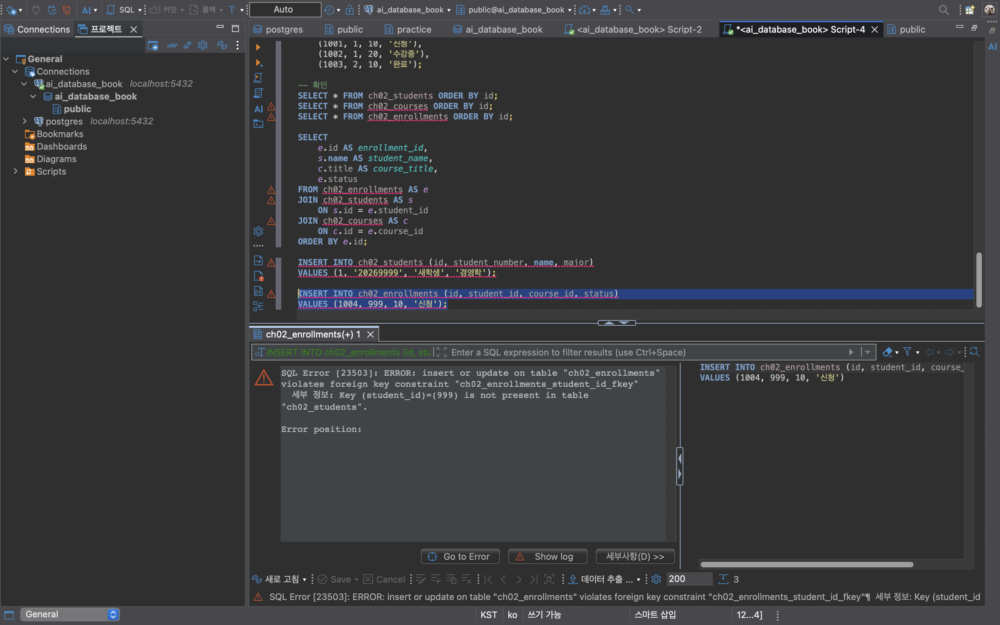
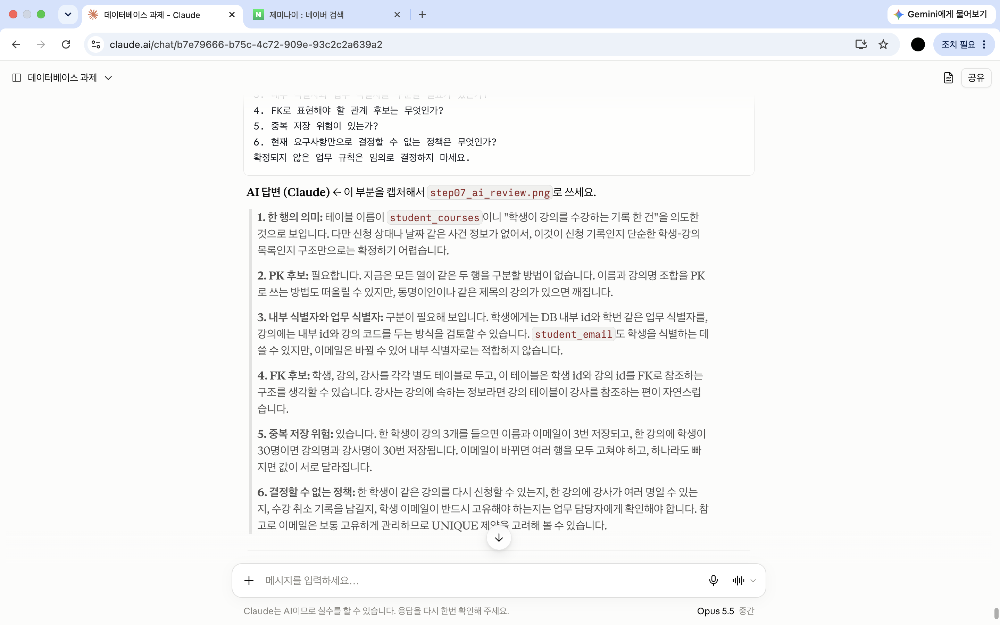

# Chapter 02 확장 실습 답안 템플릿

> **과제:** 데이터와 DBMS의 기본 개념  
> **사용 방법:** 이 파일을 내려받아 본인의 GitHub 저장소에 `chapter02_answer.md`라는 이름으로 저장한 뒤 실습하면서 바로 작성합니다.  
> **제출 방법:** LMS에는 파일을 직접 업로드하지 않고, **본인 GitHub 저장소의 `chapter02_answer.md` 파일 URL**을 제출합니다.

---

## 제출 전 개인정보 주의

LMS에서 제출자를 확인할 수 있으므로 이 공개 Markdown 파일에 학번이나 실명을 반드시 적을 필요는 없습니다.

```text
GitHub 계정 또는 별칭: han-jaesun
과제 작성일: 2026-09-27
사용한 AI 도구: Claude
```

> 실제 비밀번호, API Key, 전체 DB 접속 URL, 개인정보가 포함된 화면은 올리지 않습니다.

---

# 1. PostgreSQL에서 현재 위치 확인

## 1-1. 실행한 SQL

```sql
SELECT version();
SELECT current_database();
SELECT current_user;
SELECT current_schema();
SHOW search_path;
```

## 1-2. 실행 결과 기록

```text
PostgreSQL 버전: PostgreSQL 18.6 (Homebrew) on aarch64-apple-darwin24.6.0
현재 데이터베이스: ai_database_book
현재 사용자: hanjaesun
현재 스키마: public
search_path: public, "$user"
```

## 1-3. 구조를 내 말로 설명

```text
PostgreSQL은:
내 컴퓨터(localhost:5432)에서 실행되는 DBMS로, 여러 데이터베이스를 관리하고 SQL을 실행해 결과를 돌려주는 서버 프로그램이다.
DBeaver를 종료해도 PostgreSQL 서버는 따로 실행되고 있으므로 데이터는 사라지지 않는다.

현재 접속한 데이터베이스는:
ai_database_book이다. PostgreSQL이라는 DBMS 안에 만들어진 여러 데이터베이스 중 하나이며,
같은 서버에 postgres 데이터베이스도 따로 존재한다. 따라서 PostgreSQL과 현재 데이터베이스는 같은 것이 아니다.

스키마는:
데이터베이스 안에서 테이블 같은 객체를 이름으로 나누어 관리하는 공간이다.
public은 PostgreSQL 제품 이름도, 데이터베이스 이름도 아닌 ai_database_book 안의 기본 스키마 이름이다.

DBeaver 또는 psql 같은 도구는:
PostgreSQL에 접속해 SQL을 보내고 결과를 화면에 보여주는 클라이언트이다. 데이터를 직접 저장하지는 않는다.
```

## 1-4. 계층 구조 완성

```text
사용자
→ DBeaver (클라이언트)
→ PostgreSQL DBMS
→ ai_database_book (데이터베이스)
→ public (스키마)
→ 테이블
→ 행 / 열
```

## 1-5. 증거 화면

권장 경로:

```text
assignments/chapter02/images/step01_environment.png
```



`여기에 STEP 1 핵심 증거 화면을 삽입하세요.`

---

# 2. 데이터베이스 안의 스키마와 테이블 관찰

## 2-1. 스키마 조회 결과

실행한 SQL:

```sql
SELECT schema_name
FROM information_schema.schemata
ORDER BY schema_name;
```

관찰한 스키마 이름 중 3개 이내를 적습니다.

```text
1. public
2. pg_catalog
3. information_schema
```

### `public`은 무엇인가요?

```text
나의 설명:
ai_database_book 데이터베이스 안에 기본으로 만들어져 있는 스키마이다.
current_schema() 결과도 public이었으므로, 스키마 이름을 따로 쓰지 않고 테이블을 만들면
기본적으로 public 스키마 안에 만들어진다. DBeaver의 Schemas 목록에서도 "standard public schema"로 표시되었다.
```

### 데이터베이스와 스키마는 같은 것인가요?

```text
나의 설명:
같지 않다. 데이터베이스(ai_database_book)가 더 큰 공간이고, 스키마는 그 데이터베이스 안에 있는 이름 공간이다.
실제로 ai_database_book 하나 안에 public, pg_catalog, information_schema, pg_toast 네 개의 스키마가 함께 들어 있었다.
그래서 public.students처럼 "스키마.테이블" 형식으로 어느 스키마의 테이블인지 구분할 수 있다.
```

## 2-2. 현재 보이는 테이블 조회

```sql
SELECT table_schema, table_name
FROM information_schema.tables
WHERE table_type = 'BASE TABLE'
  AND table_schema NOT IN ('pg_catalog', 'information_schema')
ORDER BY table_schema, table_name;
```

```text
조회된 사용자 테이블 수 또는 눈에 띈 테이블:
0개

아직 테이블이 거의 없어도 괜찮은 이유:
데이터베이스를 만들었다고 테이블이 자동으로 생기지는 않는다.
테이블은 직접 만들어야 생기는데, 아직 만든 적이 없으므로 0개가 정상이다.
수업용 테이블은 Chapter 04부터 만든다.
```

## 2-3. 관찰 정리

```text
PostgreSQL 서버 안에는 여러 데이터베이스가 있을 수 있다.
한 데이터베이스 안에는 여러 스키마가 있을 수 있다.
스키마 안에는 테이블과 같은 데이터베이스 객체가 존재한다.
```

---

# 3. TEMP TABLE로 테이블·행·열·키 직접 확인

## 3-1. 임시 테이블 생성 완료 확인

- [O] `ch02_students` 생성
- [O] `ch02_courses` 생성
- [O] `ch02_enrollments` 생성

각 테이블의 **한 행 의미**를 적습니다.

| 테이블 | 한 행의 의미 |
| --- | --- |
| `ch02_students` | 학생 한 명 |
| `ch02_courses` | 강의 한 개 |
| `ch02_enrollments` | 특정 학생이 특정 강의를 신청한 사건 한 건 |

## 3-2. 열의 의미 확인

### `ch02_students`

| 열 | 값의 의미 | 내부 식별자 / 업무 식별자 / 일반 속성 |
| --- | --- | --- |
| `id` | DB 안에서 학생 행을 구분하는 번호 (PK) | 내부 식별자 |
| `student_number` | 학교에서 부여한 학번 | 업무 식별자 |
| `name` | 학생 이름 | 일반 속성 |
| `major` | 전공 | 일반 속성 |

### `ch02_enrollments`

| 열 | 값의 의미 | PK / FK / 일반 속성 |
| --- | --- | --- |
| `id` | 수강신청 한 건을 구분하는 번호 | PK |
| `student_id` | 신청한 학생 (ch02_students.id를 참조) | FK |
| `course_id` | 신청한 강의 (ch02_courses.id를 참조) | FK |
| `status` | 신청 상태 (신청 / 수강중 / 완료) | 일반 속성 |

## 3-3. 입력된 행 수

```text
students 행 수: 3 (예상 3)
courses 행 수: 2 (예상 2)
enrollments 행 수: 3 (예상 3)
```

## 3-4. 내부 식별자와 업무 식별자

```text
students.id가 필요한 이유:
DB 안에서 학생 행을 안정적으로 구분하고, 수강신청 테이블의 student_id가 이 값을 참조해 학생과 연결하기 때문이다.

student_number가 필요한 이유:
학교 업무에서 실제로 학생을 찾고 확인할 때 쓰는 번호이기 때문이다. 사람은 id=1보다 학번으로 학생을 식별한다.

둘을 항상 같은 값으로 사용하지 않아도 되는 이유:
실제로 김민지는 id가 1이지만 학번은 00123456으로 서로 다르다.
학번은 학교 정책에 따라 형식이 바뀔 수 있는데, 내부 id를 따로 두면 학번이 바뀌어도
수강신청처럼 id를 참조하는 다른 데이터는 그대로 유지할 수 있다.
```

## 3-5. 숫자처럼 보이는 학번을 문자열로 저장한 이유

```text
나의 설명:
학번은 더하거나 평균을 내는 계산용 숫자가 아니라 학생을 구분하는 이름표 같은 값이다.
김민지의 학번 00123456을 숫자 타입으로 저장하면 앞의 00이 사라져 123456이 되어 다른 학번처럼 보이게 된다.
그래서 앞자리 0을 보존하기 위해 TEXT(문자열)로 저장했다. 겉모양이 숫자라고 항상 숫자 타입이 맞는 것은 아니다.
```

---

# 4. 테이블과 조회 결과는 다르다

## 4-1. 원본 테이블 행 수

```text
ch02_students 전체 행 수: 3
```

## 4-2. 일부 열만 조회

실행 SQL:

```sql
SELECT name, major
FROM ch02_students
ORDER BY id;
```

```text
원본 테이블의 열 수와 조회 결과의 열 수가 다른 이유:
원본 테이블 ch02_students에는 id, student_number, name, major 4개 열이 있지만,
SELECT name, major는 그중 이름과 전공 두 열만 보여 달라는 요청이기 때문이다.
조회 결과는 SQL이 선택한 열만 보여주는 결과 집합일 뿐이고, 원본 테이블의 id와 student_number 열이 삭제된 것은 아니다.
실제로 SELECT *로 다시 조회하면 4개 열이 모두 그대로 보인다.
```

## 4-3. 조건을 적용한 조회

실행 SQL:

```sql
SELECT id, student_number, name, major
FROM ch02_students
WHERE major = '컴퓨터공학'
ORDER BY id;
```

```text
원본 테이블 행 수: 3
조회 결과 행 수: 2
원본 테이블의 데이터가 삭제된 것인가?: 아니다.
그렇게 판단한 이유:
WHERE major = '컴퓨터공학'은 전공이 컴퓨터공학인 학생만 골라서 보여 달라는 조건일 뿐이다.
조회 결과에 이준호(데이터사이언스)가 보이지 않았지만, 바로 이어서 SELECT COUNT(*)로 원본을 다시 세어 보니
여전히 3명이었다. 조회 결과는 조건에 맞는 행만 골라 만든 결과 집합이고, 원본 테이블은 그대로이다.
```

## 4-4. 정렬 결과 비교

```sql
SELECT id, name
FROM ch02_students
ORDER BY name ASC;

SELECT id, name
FROM ch02_students
ORDER BY name DESC;
```

```text
ASC 결과의 첫 학생: 김민지 (김민지 → 박서연 → 이준호)
DESC 결과의 첫 학생: 이준호 (이준호 → 박서연 → 김민지)

이 실험을 통해 ORDER BY에 대해 알게 된 점:
같은 테이블을 조회해도 ORDER BY 기준에 따라 결과의 순서가 완전히 달라졌다.
원본 데이터는 바뀌지 않았고, 보여주는 순서만 바뀐 것이다.
따라서 화면에 한 번 특정 순서로 보였다고 해서 테이블이 그 순서를 항상 보장하는 것은 아니며,
업무에서 순서가 중요하다면 ORDER BY로 정렬 기준을 직접 지정해야 한다.
```

## 4-5. 증거 화면

권장 경로:

```text
assignments/chapter02/images/step04_result_set.png
```



---

# 5. PK와 FK를 실제로 관찰

## 5-1. 정상 데이터의 관계 읽기

다음 SQL 결과를 보고 작성합니다.

```sql
SELECT
    e.id AS enrollment_id,
    s.name AS student_name,
    c.title AS course_title,
    e.status
FROM ch02_enrollments AS e
JOIN ch02_students AS s
    ON s.id = e.student_id
JOIN ch02_courses AS c
    ON c.id = e.course_id
ORDER BY e.id;
```

```text
한 행이 의미하는 것:
수강신청 한 건이다. 예를 들어 1001번 행은 "김민지가 데이터베이스 입문을 신청했고 상태는 신청"이라는 뜻이다.
수강신청 표의 번호(student_id, course_id)를 학생 표와 강의 표에서 찾아 이름으로 바꿔 보여준 결과이다.

같은 student_id가 여러 enrollment 행에서 반복될 수 있는 이유:
학생 한 명이 여러 강의를 신청할 수 있기 때문이다. 실제로 김민지(student_id=1)는 1001, 1002 두 건에 나타났다.

같은 course_id가 여러 enrollment 행에서 반복될 수 있는 이유:
강의 하나를 여러 학생이 신청할 수 있기 때문이다. 실제로 데이터베이스 입문(course_id=10)은
김민지(1001)와 이준호(1003) 두 건에 나타났다.
```

## 5-2. 기본키 중복 오류 관찰

중복 PK 입력을 시도한 결과:

```text
실행 성공 / 실패: 실패
오류 메시지에서 확인한 핵심 단어: duplicate key, ch02_students_pkey, Key (id)=(1) already exists
왜 실패했다고 생각하는가:
id는 ch02_students의 기본키(PK)이고, id=1은 이미 김민지 행에서 쓰고 있다.
PK는 한 테이블 안에서 각 행을 고유하게 구분하는 값이라 같은 값을 두 행에 쓸 수 없으므로,
PostgreSQL이 새학생을 id=1로 저장하지 못하게 막았다.
```

## 5-3. 존재하지 않는 학생을 참조하는 FK 오류 관찰

존재하지 않는 `student_id`를 사용한 수강신청 입력 결과:

```text
실행 성공 / 실패: 실패
오류 메시지에서 확인한 핵심 단어: foreign key constraint, ch02_enrollments_student_id_fkey, Key (student_id)=(999) is not present in table "ch02_students"
왜 실패했다고 생각하는가:
ch02_enrollments.student_id는 ch02_students.id를 참조하는 외래키(FK)이다.
그런데 학생 표에는 id가 1, 2, 3인 학생만 있고 999번 학생은 없다.
존재하지 않는 학생의 수강신청을 저장하면 누가 신청했는지 알 수 없는 잘못된 데이터가 되므로,
PostgreSQL이 FK 제약조건으로 저장을 막았다.
```

## 5-4. PK와 FK의 차이 정리

```text
PK는 한 테이블 안에서 각 행을 겹치지 않게 구분 하기 위한 키이다.

FK는 다른 테이블에 실제로 존재하는 행만 참조하도록 연결 하기 위한 키이다.

FK 값이 여러 행에서 반복될 수 있는 이유는
학생 한 명이 여러 강의를 신청하는 것처럼 한 대상이 여러 행과 연결될 수 있기 (1:N 관계이기) 때문이다.
실제로 이준호(student_id=2)의 수강신청 1004를 추가했을 때 2가 두 번 나타났지만 정상적으로 저장되었다.
```

## 5-5. 증거 화면

권장 경로:

```text
assignments/chapter02/images/step05_pk_fk.png
```

> 오류 메시지는 전체 화면이 아니라 테이블명·constraint·참조 오류가 보이는 정도만 캡처합니다.



---

# 6. 관계와 카디널리티를 자연어로 설명

현재 임시 데이터 기준으로 작성합니다.

```text
학생 한 명은 여러 수강신청을 가질 수 있는가?:
그렇다. 김민지(student_id=1)는 2건, 이준호(student_id=2)도 2건의 수강신청을 가지고 있다.

강의 한 개는 여러 수강신청을 가질 수 있는가?:
그렇다. 데이터베이스 입문(course_id=10)과 파이썬 기초(course_id=20) 모두 2건씩 신청되었다.

수강신청 한 건은 학생 몇 명을 참조하는가?:
한 명이다. 수강신청 한 행에는 student_id가 하나만 있다.

수강신청 한 건은 강의 몇 개를 참조하는가?:
한 개이다. 수강신청 한 행에는 course_id가 하나만 있다.
```

아래 구조를 완성합니다.

```text
students 1 ── N enrollments N ── 1 courses
```

### 학생과 강의가 N:M 관계라고 볼 수 있는 이유

```text
나의 설명:
학생 한 명은 여러 강의를 신청할 수 있고(김민지 → 데이터베이스 입문, 파이썬 기초),
강의 하나도 여러 학생이 신청할 수 있다(데이터베이스 입문 → 김민지, 이준호).
양쪽 모두 여러 개와 연결될 수 있으므로 학생과 강의는 N:M 관계이다.
이 관계를 두 테이블만으로는 표현하기 어려워서, 중간에 enrollments(수강신청) 연결 테이블을 두고
학생–수강신청(1:N), 강의–수강신청(1:N) 두 개의 1:N 관계로 나누어 표현한다.
```

> 아직 0개 허용 여부, 필수 관계, 삭제 정책까지 확정하지 않습니다. 그런 규칙은 Chapter 05~06에서 다룹니다.

---

# 7. AI가 만든 테이블 구조 직접 검토

## 7-1. AI에게 묻기 전에 내가 먼저 찾은 문제

다음 구조를 보고 최소 4개를 적습니다.

```sql
CREATE TABLE student_courses (
    student_name VARCHAR(50),
    student_email VARCHAR(100),
    course_title VARCHAR(100),
    instructor_name VARCHAR(50)
);
```

```text
문제 1. 한 행의 의미가 불분명하다. 학생 한 명인지, 강의 한 개인지, 수강신청 한 건인지 알 수 없다.
문제 2. 각 행을 구분할 기본키(PK)가 없다. 같은 학생이 같은 강의를 두 번 입력해도 구분할 방법이 없다.
문제 3. 학생·강의·강사를 id 없이 이름 문자열로만 저장한다. 동명이인이 있거나 이름이 바뀌면 누구인지 구분할 수 없고, FK로 연결할 수도 없다.
문제 4. 학생 정보, 강의 정보, 강사 정보가 한 테이블에 섞여 있다. 학생이 강의를 여러 개 신청하면 그 학생의 이름과 이메일이 여러 행에 반복 저장되고, 이메일을 바꿀 때 모든 행을 고쳐야 한다.
문제 5. 모든 열이 NULL을 허용해 필수값이 무엇인지 알 수 없다. 학생 이름 없이 강의만 있는 행도 저장될 수 있다.
```

## 7-2. AI 검토 요청 프롬프트

사용한 핵심 프롬프트를 기록합니다.

```text
나는 PostgreSQL과 데이터베이스를 처음 배우는 학생입니다.
아직 정규화와 ERD를 정식으로 배우기 전입니다.
다음 테이블 구조를 검토해 주세요.

CREATE TABLE student_courses (
    student_name VARCHAR(50),
    student_email VARCHAR(100),
    course_title VARCHAR(100),
    instructor_name VARCHAR(50)
);

완성된 정답 설계를 바로 만들어 주지 말고 다음 질문 중심으로 설명해 주세요.
1. 한 행의 의미가 명확한가?
2. PK 후보가 필요한가?
3. 내부 식별자와 업무 식별자를 구분할 필요가 있는가?
4. FK로 표현해야 할 관계 후보는 무엇인가?
5. 중복 저장 위험이 있는가?
6. 현재 요구사항만으로 결정할 수 없는 정책은 무엇인가?
확정되지 않은 업무 규칙은 임의로 결정하지 마세요.
```

## 7-3. AI 제안과 나의 판단

| AI의 지적 또는 제안 | 동의 / 수정 / 보류 | 나의 근거 |
| --- | --- | --- |
| PK가 필요하고, 이름+강의명 조합은 PK로 부적절하다 | 동의 | 실제로 TEMP TABLE로 만들어 보니 1행과 완전히 같은 5행이 아무 오류 없이 저장되었다. STEP 5에서 PK가 id 중복을 막은 것과 달리, PK가 없으면 중복 행을 막을 수 없다. 또 동명이인 김민지(4행) 때문에 이름은 행을 구분하지 못한다. |
| 학생·강의·강사를 별도 테이블로 나누고 id로 FK 연결 | 동의 | STEP 3의 students, courses, enrollments 구조와 같은 방식이다. 이름 대신 id로 연결해야 FK로 존재하지 않는 참조를 막을 수 있다(STEP 5-3에서 확인). |
| 이메일은 바뀔 수 있어 내부 식별자로 부적합하다 | 동의 | 본문의 "업무 식별자는 정책에 따라 바뀔 수 있다"는 설명과 같다. 내부 id를 따로 두면 이메일이 바뀌어도 다른 테이블과의 연결이 유지된다. |
| 한 행의 의미를 "수강 기록 한 건"으로 추정 | 수정 | 테이블 이름만 보고 추정한 것이다. 본문은 이 구조의 한 행이 "학생인지 신청인지 명확하지 않다"고 보았다. 한 행의 의미는 이름이 아니라 요구사항으로 정해야 한다. |
| 이메일은 보통 고유하니 UNIQUE를 고려 | 보류 | AI가 같은 답변에서 "이메일 고유 여부는 확인할 정책"이라고 해 놓고 바로 UNIQUE를 권했다. 업무 규칙을 확인하기 전까지 결정하지 않는다. |

## 7-4. 본문과 대조한 항목

AI 설명 중 최소 하나를 `chapter02.md`와 비교합니다.

```text
AI가 설명한 내용:
테이블 이름이 student_courses이므로 한 행은 "학생이 강의를 수강하는 기록 한 건"을 의도한 것으로 보인다.

본문에서 확인한 내용:
Chapter 02 본문 13장의 검토 표에서 이 구조의 한 행 의미를 "학생인지 신청인지 명확하지 않음"으로 판단했다.
또한 5장에서 "한 행이 무엇을 의미하는지 명확하게 정하는 것이 좋은 데이터 구조의 출발점"이라고 설명한다.

일치 / 부분 일치 / 수정 필요:
부분 일치

내가 최종적으로 이해한 내용:
AI도 확정하기 어렵다고 덧붙였지만, 테이블 이름을 근거로 한 행의 의미를 먼저 추정했다.
본문 기준으로는 구조 안에 한 행을 정의할 근거(PK, 신청 상태나 날짜 같은 사건 정보)가 없으므로 "불명확하다"가 정확한 판단이다.
직접 만들어 본 결과에서도 같은 김민지-데이터베이스 입문 행이 두 번 저장되었는데, 이것이 두 번 신청한 것인지
잘못 중복 입력한 것인지 구분할 수 없었다. 한 행의 의미는 테이블 이름이 아니라 요구사항과 구조로 정해야 한다.
```

## 7-5. 증거 화면

권장 경로:

```text
assignments/chapter02/images/step07_ai_review.png
```



---

# 8. Chapter 01의 개인 서비스 아이디어를 DB 용어로 다시 표현

Chapter 01에서 정한 개인 서비스 주제를 그대로 사용하거나 새 주제를 정해도 됩니다.

## 8-1. 서비스 기본 정보

```text
서비스 이름: 스터디메이트 (Chapter 01과 같은 주제)
서비스 목적: 학생들이 스터디 모임을 만들고 참여 신청을 하며, 모임별 일정과 출석을 기록해 꾸준한 스터디 활동을 관리하기 위한 서비스
```

## 8-2. PostgreSQL 구조 후보

```text
데이터베이스 이름 후보: ai_database_book (수업에서 사용하는 데이터베이스를 그대로 사용)
스키마 이름 후보: studymate
```

> 아직 실제 데이터베이스나 스키마를 생성하지 않아도 됩니다.

## 8-3. 테이블 후보와 한 행 의미

최소 3개를 작성합니다.

| 테이블 후보 | 한 행의 의미 | 내부 ID 후보 | 업무 식별자 후보 |
| --- | --- | --- | --- |
| `members` | 서비스에 가입한 회원 한 명 | `members.id` | 로그인 아이디 또는 학번 (확인 필요) |
| `studies` | 개설된 스터디 모임 하나 | `studies.id` | 없음 (확인 필요) |
| `study_memberships` | 한 회원이 특정 스터디에 참여를 신청한 사건 한 건 | `study_memberships.id` | 없음 |
| `study_sessions` | 특정 스터디의 모임 회차 한 번 (예: 3주차 모임) | `study_sessions.id` | 없음 |
| `attendances` | 한 회원이 특정 모임 회차에 출석했는지에 대한 기록 한 건 | `attendances.id` | 없음 |

## 8-4. FK 후보

```text
1. study_memberships.member_id → members.id
   이유: 참여 신청 한 건은 반드시 실제로 가입한 회원이 한 것이어야 하므로, 존재하지 않는 회원의 신청을 막기 위해 FK로 연결한다.

2. study_memberships.study_id → studies.id
   이유: 참여 신청은 실제로 개설된 스터디에 대한 것이어야 하므로 FK로 연결한다.

3. study_sessions.study_id → studies.id
   이유: 모임 회차는 하나의 스터디에 속하므로, 어느 스터디의 회차인지 FK로 연결한다.

4. attendances.member_id → members.id, attendances.session_id → study_sessions.id
   이유: 출석 기록은 한 회원과 한 모임 회차를 연결하는 기록이므로 둘 다 FK로 참조한다.

5. studies.leader_id → members.id
   이유: 스터디를 개설한 회원(스터디장)이 실제 회원이어야 하므로 FK로 연결한다.
```

## 8-5. 자연어 관계 문장

```text
1. 한 회원은 여러 스터디에 참여 신청할 수 있고, 한 스터디에는 여러 회원이 참여할 수 있다.
   (회원과 스터디는 N:M 관계이며, study_memberships 연결 테이블로 두 개의 1:N 관계로 표현한다.)
2. 한 스터디는 여러 모임 회차를 가질 수 있고, 모임 회차 하나는 한 스터디에만 속한다. (1:N)
3. 출석 기록 한 건은 회원 한 명과 모임 회차 하나를 참조한다.
```

## 8-6. 아직 확정하지 않을 정책

```text
Q1. 회원의 업무 식별자로 학번을 쓸 것인가, 로그인 아이디나 이메일을 쓸 것인가? 그 값은 반드시 고유해야 하는가?
Q2. 한 회원이 같은 스터디에 탈퇴 후 다시 신청하는 것을 허용하는가? 허용하면 study_memberships에 같은 회원-스터디 조합이 여러 행 생길 수 있다.
Q3. 탈퇴한 회원의 참여 신청과 출석 기록은 삭제하는가, 상태만 바꿔서 보관하는가?
```

---

# 9. AI를 개인 구조의 검토자로 사용

## 9-1. 사용한 프롬프트

```text
나는 데이터베이스 초보자입니다.
Chapter 02까지 학습했고 아직 ERD와 정규화는 정식으로 배우지 않았습니다.
내 서비스 구조 초안은 다음과 같습니다.

서비스 이름: 스터디메이트 (스터디 모임 관리 서비스)

테이블 후보와 한 행 의미:
- members / 서비스에 가입한 회원 한 명
- studies / 개설된 스터디 모임 하나
- study_memberships / 한 회원이 특정 스터디에 참여를 신청한 사건 한 건
- study_sessions / 특정 스터디의 모임 회차 한 번
- attendances / 한 회원이 특정 모임 회차에 출석했는지에 대한 기록 한 건

내부 식별자 후보:
- 각 테이블의 id

업무 식별자 후보:
- members: 로그인 아이디 또는 학번 (확인 필요)

FK 후보:
- study_memberships.member_id → members.id
- study_memberships.study_id → studies.id
- study_sessions.study_id → studies.id
- attendances.member_id → members.id, attendances.session_id → study_sessions.id
- studies.leader_id → members.id

미확정 정책:
- 회원 업무 식별자로 무엇을 쓸지, 고유해야 하는지
- 탈퇴 후 같은 스터디 재신청 허용 여부
- 탈퇴 회원의 기록 삭제 또는 보관 여부

정답 설계를 대신 작성하지 말고 다음을 질문 형태로 검토해 주세요.
1. DBMS / database / schema / table을 혼동한 곳
2. 한 행 의미가 모호한 곳
3. 내부 식별자와 업무 식별자를 혼동한 곳
4. PK와 FK 역할을 잘못 이해한 곳
5. FK가 필요한데 빠진 관계 후보
6. 아직 업무 담당자에게 확인해야 할 정책
근거 없이 정책을 확정하지 마세요.
```

## 9-2. AI가 질문한 내용 중 유용했던 것

```text
1. attendances를 출석한 경우에만 만드는가, 결석도 기록하는가?
   → 출석한 사람만 기록하면 결석자가 데이터에 없어 출석률을 계산할 수 없다는 점을 알게 되었다.
2. attendances가 members.id를 직접 참조하면 스터디에 참여하지 않은 회원의 출석도 저장될 수 있지 않은가?
   → FK는 "존재하는 회원인지"만 검사하고 "그 스터디 참여자인지"까지는 검사하지 않는다는 점을 알게 되었다.
3. studies.leader_id는 개설자인가, 현재 운영자인가?
   → Chapter 01에서도 나왔던 문제로, 한 열에 두 의미가 섞일 수 있다는 점을 다시 확인했다.
```

## 9-3. AI가 너무 빨리 결정한 내용 또는 내가 보류한 내용

```text
1. study_memberships의 회원-스터디 조합에 UNIQUE를 거는 방식을 "일반적"이라며 제안했다.
   하지만 재신청 허용 여부(Q2)는 아직 확정하지 않은 정책이다. 재신청을 허용하면 같은 조합이 여러 행 필요하므로,
   정책이 정해지기 전까지 UNIQUE 여부는 보류한다.
2. 수업용 데이터베이스(ai_database_book) 안에 studymate 스키마를 두는 방식에 대해 서비스용 데이터베이스를 따로 둘지 물었다.
   현재는 수업 실습용이므로 ai_database_book 안에 스키마로 구분하는 방식을 유지하고, 실제 서비스로 확장할 때 다시 검토한다.
```

## 9-4. 검토 후 수정한 구조

| 수정 전 | 수정 후 | 수정 이유 |
| --- | --- | --- |
| `attendances` 한 행: 한 회원이 특정 회차에 출석했는지에 대한 기록 | `attendances` 한 행: 한 회원의 특정 회차 출석 상태 기록 한 건 (출석하지 않은 경우도 행을 남김) | 출석한 사람만 기록하면 결석자가 빠져 출석률을 계산할 수 없다. 출석 상태 값(지각·공결 포함 여부)은 Chapter 01 Q3 정책 확정 후 정한다. |
| `attendances.member_id → members.id` | `attendances.membership_id → study_memberships.id` 방식을 후보로 추가하고 비교 | members를 직접 참조하면 스터디 참여자가 아닌 회원의 출석도 저장될 수 있다. 참여 신청을 참조하면 그 스터디 참여자만 출석 기록을 가질 수 있다. |
| `studies.leader_id → members.id` (스터디장) | `studies.created_by → members.id` (개설자)로 이름을 바꾸고, 현재 운영자는 별도 확인 필요로 남김 | 개설자와 현재 운영자가 다를 수 있으므로 한 열에 두 의미를 섞지 않는다. |

---

# 10. 최종 개념 정리

아래 문장을 본인의 말로 완성합니다.

```text
PostgreSQL은 내 컴퓨터(localhost:5432)에서 따로 실행되면서 여러 데이터베이스를 관리하고, SQL을 받아 실행한 뒤 결과를 돌려주는 DBMS 이다.

DBeaver 또는 psql은 PostgreSQL에 접속해 SQL을 보내고 결과를 화면에 보여주는 클라이언트 도구로, 데이터를 직접 저장하지는 않는 프로그램 이다.

데이터베이스와 스키마의 차이는 데이터베이스(ai_database_book)가 더 큰 공간이고, 스키마(public 등)는 그 안에서 테이블을 이름으로 나누어 담는 공간이라는 점 이다.

테이블 한 행은 그 테이블이 저장하는 대상 하나 또는 사건 한 건으로, ch02_students에서는 학생 한 명, ch02_enrollments에서는 수강신청 한 건 이다.

조회 결과가 원본 테이블과 다른 이유는 SELECT가 필요한 열만 고르고(WHERE로) 조건에 맞는 행만 골라 새로 만든 결과 집합이기 때문이며, 컴퓨터공학 학생만 조회해도 원본은 여전히 3명이었기 때문이다.

내부 식별자와 업무 식별자의 차이는 내부 식별자(id)는 DB가 행을 안정적으로 구분하고 연결하는 데 쓰는 바뀌지 않는 번호이고, 업무 식별자(학번)는 실제 업무에서 사람이 쓰는 번호라 정책에 따라 바뀔 수 있다는 점 이다.

PK는 한 테이블 안에서 각 행을 겹치지 않게 구분하는 키로, 이미 있는 id=1로 학생을 추가하려 하자 duplicate key 오류로 막혔던 것 이다.

FK는 다른 테이블에 실제로 존재하는 행만 가리키도록 연결하는 키로, 없는 999번 학생으로 수강신청을 넣으려 하자 foreign key 오류로 막혔고, 같은 학생 번호가 여러 신청에 반복되는 것은 허용되는 것 이다.
```

---

# 11. 이번 Chapter에서 새롭게 알게 된 점

최소 3개를 작성합니다.

```text
1. PostgreSQL 서버 하나 안에 여러 데이터베이스(ai_database_book, postgres)가 있고,
   데이터베이스 하나 안에 다시 여러 스키마(public, pg_catalog 등)가 있다는 것을 실제 SQL 결과로 확인했다.
   DBMS, 데이터베이스, 스키마, 테이블이 모두 다른 단계라는 것을 알게 되었다.

2. SELECT 결과는 원본 테이블이 아니다. 일부 열만 고르거나 WHERE로 조건을 걸어도 원본은 그대로이며,
   ORDER BY를 쓰지 않으면 결과 순서도 보장되지 않는다. 엑셀의 필터나 열 숨기기와 비슷하다.

3. PK와 FK는 실제로 잘못된 데이터를 막아 준다. 이미 있는 id로 학생을 넣으면 PK가 막고,
   없는 학생 번호로 수강신청을 넣으면 FK가 막았다. 반면 FK 값은 한 학생이 여러 강의를 신청하는 것처럼
   여러 행에서 반복될 수 있다.
```

## 아직 헷갈리는 내용

```text
1. JOIN ... ON으로 세 테이블을 연결하는 SQL을 처음 봤을 때 이해하기 어려웠다.
   "신청서의 번호를 들고 다른 표에 가서 같은 번호를 찾아 붙인다"는 원리는 이해했지만,
   JOIN 문법을 직접 작성하는 것은 아직 익숙하지 않다.
```

## AI에게 다시 질문하고 싶은 내용

```text
스터디메이트에서 출석 기록(attendances)이 회원(members)을 직접 참조하는 방식과
참여 신청(study_memberships)을 참조하는 방식 중 어떤 것이 더 적합한지,
각각의 장단점을 작은 예시 데이터로 비교해서 설명해 달라고 질문하고 싶다.
```

---

# 12. 제출 전 자기 점검

- [O] PostgreSQL에서 현재 database / schema / search_path를 확인했다.
- [O] DBMS, database, schema, table을 구분해서 설명할 수 있다.
- [O] TEMP TABLE 3개를 생성하고 직접 데이터를 조회했다.
- [O] 각 테이블의 한 행 의미를 작성했다.
- [O] 테이블과 조회 결과가 다르다는 것을 실제 SQL로 확인했다.
- [O] `ORDER BY`를 사용하지 않으면 업무 순서를 가정하면 안 된다는 점을 이해했다.
- [O] 내부 식별자와 업무 식별자의 차이를 설명할 수 있다.
- [O] PK 중복 입력 실패를 직접 확인했다.
- [O] 존재하지 않는 FK 참조 실패를 직접 확인했다.
- [O] FK 값이 반복될 수 있는 이유를 설명할 수 있다.
- [O] AI가 만든 테이블을 내가 먼저 검토했다.
- [O] AI 설명 중 최소 하나를 본문과 대조했다.
- [O] 개인 서비스의 테이블 후보를 3개 이상 작성했다.
- [O] 개인 서비스의 FK 후보와 미확정 정책을 기록했다.
- [O] 실제 비밀번호·API Key·민감한 접속 정보가 포함되지 않았는지 확인했다.
- [O] 이미지 링크가 GitHub에서 정상적으로 보이는지 확인했다.

---

# 13. GitHub 제출 정보

답안 파일 권장 위치:

```text
assignments/chapter02/chapter02_answer.md
```

이미지 권장 위치:

```text
assignments/chapter02/images/
```

LMS 제출 URL 형식:

```text
https://github.com/han-jaesun/database-hw/blob/main/assignments/chapter02/chapter02_answer.md
```

## 최종 확인

- [O] 위 URL을 로그아웃 상태 또는 다른 브라우저에서 열어도 확인 가능하다.
- [O] Markdown이 정상 렌더링된다.
- [O] 이미지가 깨지지 않는다.
- [O] LMS에 교수자 템플릿 URL이 아니라 **내 답안 파일 URL**을 제출했다.
