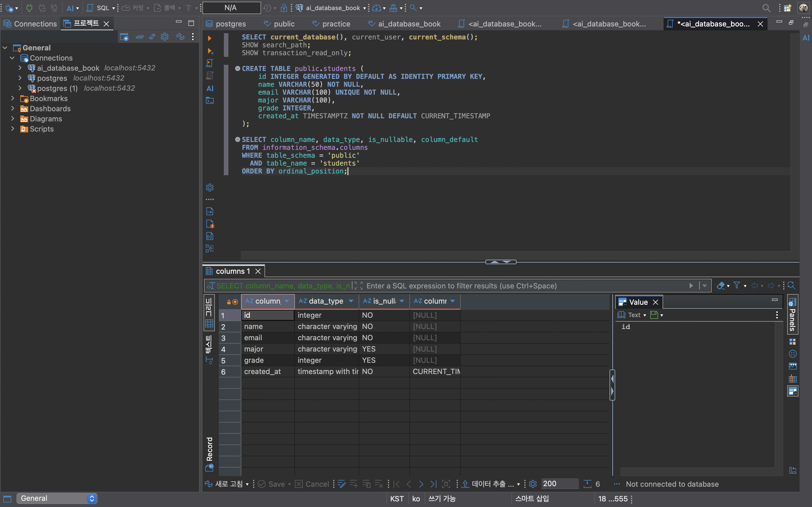
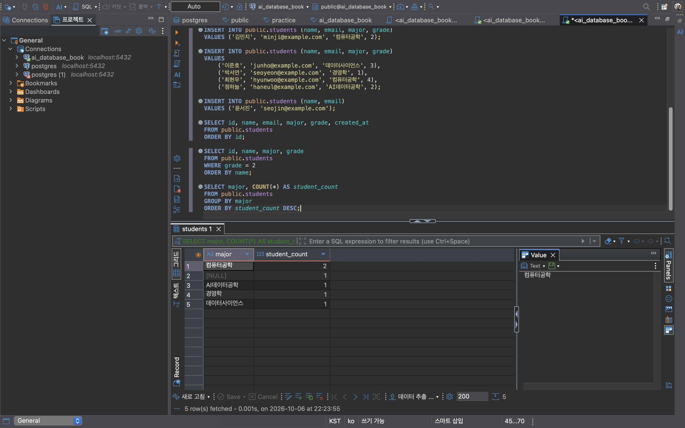
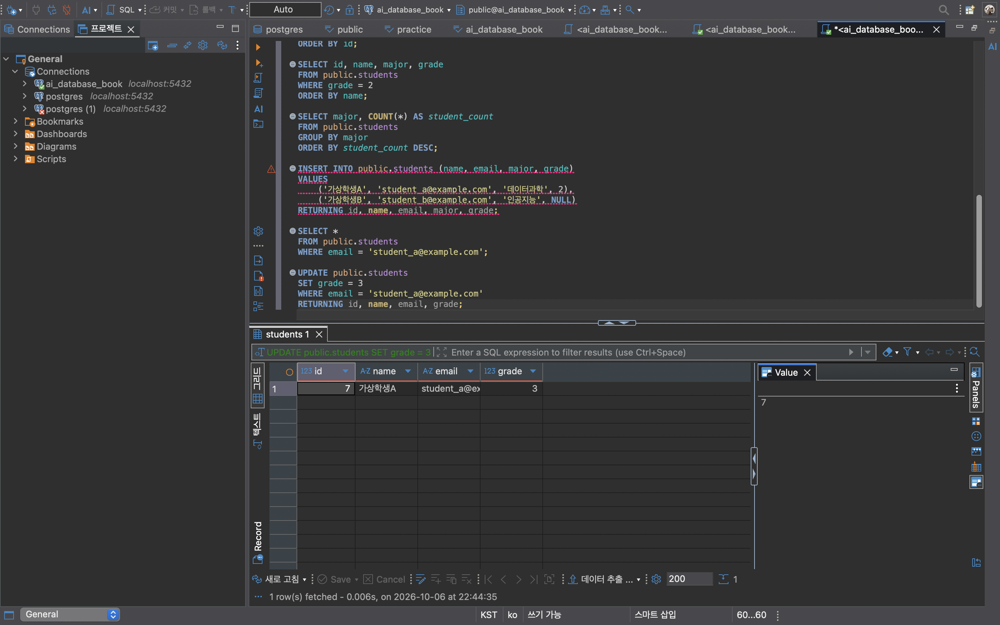
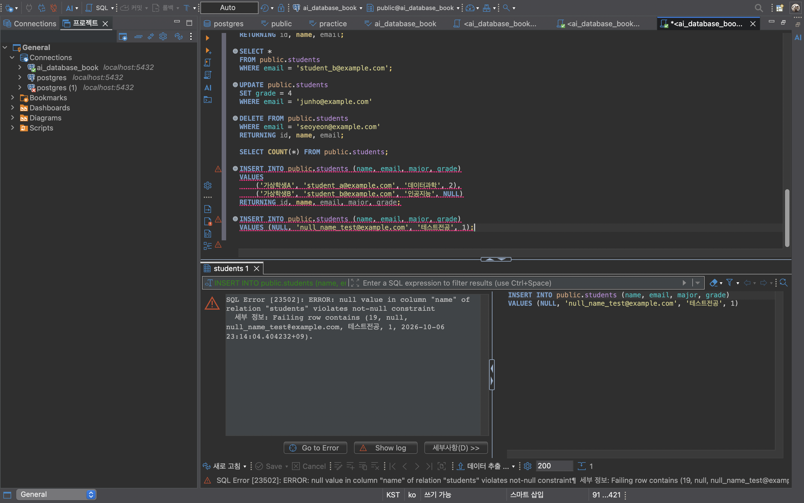

# Chapter 04 확장 실습 답안 템플릿

> **과제:** 관계형 데이터베이스와 SQL 시작하기  
> **사용 방법:** 이 파일을 내려받아 본인의 GitHub 저장소에 `chapter04_answer.md`라는 이름으로 저장한 뒤 실습하면서 바로 작성합니다.  
> **제출 방법:** LMS에는 파일을 직접 업로드하지 않고, **본인 GitHub 저장소의 `chapter04_answer.md` 파일 URL**을 제출합니다.

---

## 제출 전 주의

이 파일과 캡처 화면에는 실제 비밀번호, 전체 DB 접속 URL, API Key, 개인정보를 기록하지 않습니다.

```text
GitHub 계정 또는 별칭: han-jaesun
과제 작성일: 2026-10-06
사용한 AI 도구: Claude
```

---

# 1. 실습 환경과 시작 상태 확인

다음을 실행합니다.

```sql
SELECT current_database();
SELECT current_user;
SELECT current_schema();
SHOW search_path;
SHOW transaction_read_only;
```

| 확인 항목 | 실제 결과 | 의미 |
| --- | --- | --- |
| current_database() | ai_database_book | 수업용 데이터베이스에 접속해 있다 |
| current_user | hanjaesun | 이 사용자 권한으로 SQL이 실행된다 |
| current_schema() | public | 스키마 이름을 생략하면 public에 테이블이 만들어진다 |
| search_path | public, "$user" | 스키마 이름을 생략했을 때 public 스키마부터 테이블을 찾는다 |
| transaction_read_only | off | 읽기 전용이 아니므로 테이블 생성과 데이터 변경이 가능하다 |

- [O] 현재 DB가 `ai_database_book`이다.
- [O] 변경 가능한 연결인지 확인했다.
- [O] 실행할 SQL 범위를 확인했다.
- [O] Auto-commit 상태를 확인했다.

### 변경 SQL을 실행하기 전에 현재 DB와 실행 범위를 확인해야 하는 이유

```text
INSERT, UPDATE, DELETE는 실제 데이터를 바꾸기 때문에, 엉뚱한 데이터베이스나 스키마에서 실행하면
다른 데이터가 바뀌거나 테이블이 잘못된 곳에 만들어질 수 있다.
또 DBeaver에서 여러 줄을 선택한 채 실행하면 의도하지 않은 SQL까지 함께 실행될 수 있으므로,
어떤 연결에서 어떤 문장을 실행하는지 먼저 확인해야 한다.
```

---

# 2. `public.students` 구조 생성

## 2-1. 실행 전 예상

```text
테이블 이름: public.students
한 행의 의미: 학생 한 명
예상 행 수: 0 (테이블 구조만 만들고 아직 데이터는 넣지 않았으므로)
기본키: id
필수 열: id, name, email, created_at (NOT NULL)
중복을 막는 열: email (UNIQUE), id (PRIMARY KEY)
자동 생성 열: id (GENERATED AS IDENTITY, 번호 자동 부여), created_at (DEFAULT CURRENT_TIMESTAMP, 입력 시각 자동 저장)
```

## 2-2. 실행 파일

```text
code/chapter04/01_create_students.sql
```

## 2-3. 실행 후 확인

```text
테이블 생성 성공 여부: 성공 (오류 없이 CREATE TABLE 완료)
실제 행 수: 0
DBeaver에서 확인한 위치: ai_database_book → ai_database_book → public → Tables → students
```

### 각 열의 역할

| 열 | 타입 | NULL 가능? | 역할 |
| --- | --- | --- | --- |
| id | integer | NO | 학생 행을 구분하는 기본키. 값을 안 넣으면 자동으로 번호가 부여된다 |
| name | character varying(50) | NO | 학생 이름. 반드시 입력해야 한다 |
| email | character varying(100) | NO | 학생 이메일. 필수이며 다른 학생과 중복될 수 없다(UNIQUE) |
| major | character varying(100) | YES | 전공. 아직 정해지지 않았으면 비워 둘 수 있다 |
| grade | integer | YES | 학년. 아직 모르면 비워 둘 수 있다 |
| created_at | timestamp with time zone | NO | 행이 입력된 시각. 값을 안 넣으면 현재 시각이 자동으로 들어간다 |

### `id`를 학번이나 학생 수로 해석하면 안 되는 이유

```text
id는 DB가 행을 구분하려고 자동으로 붙이는 내부 번호일 뿐, 학교에서 부여한 학번이 아니다.
또 학생을 삭제하거나 입력이 실패해도 이미 쓴 번호는 다시 채워지지 않기 때문에,
id가 6이라고 해서 학생이 6명이라는 뜻도 아니다. 학생 수는 COUNT(*)로 따로 세어야 한다.
```

### 증거 화면

권장 경로:

```text
assignments/chapter04/images/step02_table.png
```



---

# 3. 샘플 데이터 6명 입력

## 3-1. 실행 전 예상

```text
현재 행 수: 0
실행 후 예상 행 수: 6
예상되는 NULL 포함 학생: 윤서진 (이름과 이메일만 입력하고 전공과 학년을 생략했으므로 major, grade가 NULL)
```

## 3-2. 실행 파일

```text
code/chapter04/02_insert_students.sql
```

## 3-3. 실제 결과

```text
실제 행 수: 6
이준호 grade: 3
박서연 존재 여부: 존재함 (경영학, 1학년)
윤서진 major: NULL
윤서진 grade: NULL
```

### 예상과 실제 비교

```text
예상과 실제가 일치했는가: 일치했다. 6명이 입력되었고, 윤서진만 major와 grade가 NULL이었다.
다르다면 이유: 해당 없음
```

### `created_at` 값이 여러 행에서 같을 수 있는 이유

```text
created_at은 값을 넣지 않으면 CURRENT_TIMESTAMP가 자동으로 들어가는데,
CURRENT_TIMESTAMP는 SQL이 실행된 순간이 아니라 트랜잭션이 시작된 시각을 기준으로 한다.
그래서 같은 트랜잭션 안에서 여러 행을 한꺼번에 넣으면, 예를 들어 이준호부터 정하늘까지 4명을 한 번의INSERT로 넣으면 모두 같은 시각이 저장될 수 있다. 시각이 같다고 해서 오류가 있는 것은 아니다.
```

---

# 4. SELECT 복습과 결과 검증

각 문제는 **SQL 실행 전에 예상 행 수를 먼저 작성**합니다.

| 번호 | 조회 문제 | 예상 행 수 | 실제 행 수 | 일치? | 다르면 이유 |
| ---: | --- | ---: | ---: | --- | --- |
| 1 | 전체 학생 | 6 | 6 | 일치 | |
| 2 | 이름·이메일만 조회 | 6 | 6 | 일치 | 열만 줄었고 행 수는 그대로 |
| 3 | 특정 전공 (컴퓨터공학) | 2 | 2 | 일치 | |
| 4 | 특정 학년 이상 (3학년 이상) | 2 | 2 | 일치 | 윤서진(NULL)은 비교 대상에서 빠짐 |
| 5 | 두 전공 중 하나 (컴퓨터공학, 경영학) | 3 | 3 | 일치 | |
| 6 | `grade IS NULL` | 1 | 1 | 일치 | |
| 7 | 전공 `DISTINCT` | 5 | 5 | 일치 | 전공 4종류 + NULL 1행 |
| 8 | 정렬 후 상위 3명 (id 순) | 3 | 3 | 일치 | |

## 4-1. 내가 직접 작성한 SQL 2개

```sql
-- SQL 1: 2학년 학생만 이름순으로 조회
SELECT id, name, major, grade
FROM public.students
WHERE grade = 2
ORDER BY name;
```

```text
이 SQL의 한 행 의미: 2학년 학생 한 명
예상 행 수: 2 (김민지, 정하늘)
실제 행 수: 2
```

```sql
-- SQL 2: 전공별 학생 수 세기
SELECT major, COUNT(*) AS student_count
FROM public.students
GROUP BY major
ORDER BY student_count DESC;
```

```text
이 SQL의 한 행 의미: 학생 한 명이 아니라 "전공 하나와 그 전공의 학생 수"
예상 행 수: 5 (컴퓨터공학 2명, 데이터사이언스·경영학·AI데이터공학 각 1명, 전공 없음(NULL) 1명)
실제 행 수: 5
```

## 4-2. `= NULL` 대신 `IS NULL`을 사용하는 이유

```text
NULL은 0이나 빈 문자열이 아니라 "값을 모른다"는 뜻이라, 어떤 값과 = 로 비교해도 참도 거짓도 아닌 "알 수 없음"이 된다.
그래서 WHERE grade = NULL은 윤서진처럼 학년이 비어 있는 학생도 찾지 못하고 0행이 나온다.
NULL인지 확인하려면 반드시 IS NULL을 써야 하고, 실제로 WHERE grade IS NULL은 윤서진 1행을 찾았다.
```

## 4-3. `ORDER BY` 없이 결과 순서를 믿으면 안 되는 이유

```text
테이블은 행을 특정 순서로 보관한다고 보장하지 않는다. 지금은 입력한 순서대로 보이더라도
데이터가 수정되거나 삭제되면 조회 순서가 바뀔 수 있다.
"상위 3명"처럼 순서가 의미 있는 조회는 ORDER BY로 기준을 직접 정해야 같은 결과를 얻을 수 있다.
```

## 4-4. `DISTINCT`가 원본 데이터를 삭제하는 기능인가요?

```text
아니다. DISTINCT는 조회 결과에서 중복된 값을 한 번만 보여 줄 뿐이다.
전공 DISTINCT 결과는 5행이었지만 students 테이블에는 여전히 6명이 그대로 있다.
예를 들어 컴퓨터공학 학생 2명은 결과에서 한 줄로 보였을 뿐 둘 다 삭제되지 않았다.
```

### 증거 화면

권장 경로:

```text
assignments/chapter04/images/step04_select.png
```



---

# 5. 내 가상 학생 2명 추가

실명·실제 이메일 대신 가상 데이터를 사용합니다.

## 5-1. 실행 전 계획

```text
학생 A
이름: 가상학생A
이메일: student_a@example.com
전공: 데이터과학
학년: 2

학생 B
이름: 가상학생B
이메일: student_b@example.com
전공: 인공지능
학년 또는 NULL: NULL

현재 행 수: 5
추가 후 예상 행 수: 7
```

## 5-2. 내가 실행한 INSERT

```sql
INSERT INTO public.students (name, email, major, grade)
VALUES
    ('가상학생A', 'student_a@example.com', '데이터과학', 2),
    ('가상학생B', 'student_b@example.com', '인공지능', NULL)
RETURNING id, name, email, major, grade;
```

## 5-3. 실제 결과

```text
RETURNING 또는 확인 SELECT 결과: 가상학생A(데이터과학, 2학년), 가상학생B(인공지능, 학년 NULL) 2행이 반환되었다.
실제 전체 행 수: 7
예상과 일치 여부: 일치 (5명 + 2명 = 7명)
```

### 내가 일부 값을 NULL로 둔 이유 또는 NULL을 사용하지 않은 이유

```text
가상학생B는 아직 학년이 정해지지 않은 상황을 가정해 grade를 NULL로 두었다.
grade 열은 NULL을 허용하므로 정상적으로 저장되며, 0처럼 임의의 값을 넣으면 "0학년"이라는 잘못된 정보가 되기 때문에
모르는 값은 NULL로 두는 것이 맞다. 또 다음 단계에서 이 학생을 삭제할 때 구분하기 쉽도록 학생 A와 다르게 설정했다.
```

---

# 6. 안전한 UPDATE

내가 추가한 가상 학생 한 명만 수정합니다.

## 6-1. 먼저 대상 확인 SELECT

```sql
SELECT *
FROM public.students
WHERE email = 'student_a@example.com';
```

```text
예상 대상 행 수: 1
실제 대상 행 수: 1
```

## 6-2. UPDATE

```sql
UPDATE public.students
SET grade = 3
WHERE email = 'student_a@example.com'
RETURNING id, name, email, grade;
```

```text
예상 영향 행 수: 1
실제 영향 행 수: 1
RETURNING 결과: 가상학생A, student_a@example.com, grade 3 (2학년에서 3학년으로 변경됨)
```

## 6-3. UPDATE 후 재조회

```sql
SELECT *
FROM public.students
WHERE email = 'student_a@example.com';
```

### `WHERE` 없는 UPDATE를 실행하면 위험한 이유

```text
WHERE가 없으면 조건 없이 테이블의 모든 행이 바뀐다.
예를 들어 UPDATE public.students SET grade = 3; 을 실행하면 가상학생A뿐 아니라 7명 전원의 학년이 3이 된다.
지금은 Auto-commit 상태라 실행 즉시 저장되므로 되돌리기 어렵다.
그래서 UPDATE 전에 같은 WHERE 조건으로 SELECT해서 대상이 정확히 몇 행인지 먼저 확인해야 한다.
```

### 증거 화면

권장 경로:

```text
assignments/chapter04/images/step06_update.png
```



---

# 7. 안전한 DELETE

내가 추가한 가상 학생 한 명을 삭제합니다.

## 7-1. 삭제 전 확인

```sql
SELECT *
FROM public.students
WHERE email = 'student_b@example.com';
```

```text
예상 대상 행 수: 1
실제 대상 행 수: 1
```

## 7-2. DELETE

```sql
DELETE FROM public.students
WHERE email = 'student_b@example.com'
RETURNING id, name, email;
```

```text
예상 영향 행 수: 1
실제 영향 행 수: 1
RETURNING 결과: 가상학생B, student_b@example.com 1행이 삭제되었다.
```

## 7-3. 삭제 후 재조회

```sql
SELECT *
FROM public.students
WHERE email = 'student_b@example.com';
```

```text
삭제 후 같은 조건의 SELECT 결과 행 수: 0
```

### `DELETE` 성공 메시지만 보고 끝내지 않고 다시 SELECT해야 하는 이유

```text
DELETE가 오류 없이 실행되었다는 것은 문법이 맞았다는 뜻일 뿐, 내가 의도한 학생이 정확히 지워졌다는 보장은 아니다.
WHERE 조건이 틀렸다면 0행이 지워지거나 다른 학생이 지워져도 성공 메시지는 똑같이 나올 수 있다.
그래서 같은 조건으로 다시 SELECT해서 0행이 나오는지, 전체 학생 수가 예상대로 줄었는지 직접 확인해야 한다.
```

---

# 8. 본문 기준 UPDATE·DELETE 상태 검증

`04_update_delete_students.sql`을 본문 시작 상태에서 실행했다면 다음을 확인합니다.

```text
최종 학생 수: 6
이준호 grade: 4
박서연 존재 여부: 0행 (삭제됨)
```

본문 기준 기대 상태와 비교합니다.

```text
학생 수 = 5
이준호 grade = 4
박서연 = 0행
```

### 내 실제 결과가 기준과 다르다면 원인

```text
이준호 grade = 4, 박서연 = 0행은 기준과 일치했다.
학생 수만 기준(5명)과 달리 6명이었는데, 8번을 실행하기 전에 가상학생 2명을 추가하고 그중 1명(가상학생B)만 삭제해서
내가 추가한 가상학생A 1명이 남아 있기 때문이다. UPDATE·DELETE 자체는 의도대로 실행되었다.
```

---

# 9. 의도한 실패 2개 관찰

> 실패 테스트는 데이터베이스 규칙이 실제로 데이터를 보호하는지 확인하는 실험입니다.

## 9-1. 중복 이메일 `UNIQUE` 오류

내가 사용한 SQL:

```sql
INSERT INTO public.students (name, email, major, grade)
VALUES
    ('가상학생A', 'student_a@example.com', '데이터과학', 2),
    ('가상학생B', 'student_b@example.com', '인공지능', NULL)
RETURNING id, name, email, major, grade;
```

```text
오류 메시지 핵심 단서: duplicate key value violates unique constraint "students_email_key", Key (email)=(student_a@example.com) already exists
왜 실패해야 맞는가: 이메일은 학생마다 하나씩이어야 하는데, 이미 가상학생A가 같은 이메일로 저장되어 있는 상태에서 같은 INSERT를 한 번 더 실행했기 때문이다.
어떤 규칙이 작동했는가: email 열의 UNIQUE 제약조건
실패 후 기존 데이터가 어떻게 유지되었는가: INSERT 전체가 실패해 가상학생A와 가상학생B 모두 새로 추가되지 않았고, 기존 가상학생A 데이터는 그대로 남았다.
```

## 9-2. 이름 `NULL` 입력 `NOT NULL` 오류

내가 사용한 SQL:

```sql
INSERT INTO public.students (name, email, major, grade)
VALUES (NULL, 'null_name_test@example.com', '테스트전공', 1);
```

```text
오류 메시지 핵심 단서: null value in column "name" of relation "students" violates not-null constraint
왜 실패해야 맞는가: name은 반드시 입력해야 하는 필수 열인데 이름 자리에 NULL을 넣으려 했기 때문이다. 이름 없는 학생이 저장되면 누구인지 알 수 없는 잘못된 데이터가 된다.
어떤 규칙이 작동했는가: name 열의 NOT NULL 제약조건
```

### 실패한 INSERT 뒤 자동 생성 `id` 번호에 빈 구간이 생길 수 있어도 문제라고 단정할 수 없는 이유

```text
id는 INSERT를 시도할 때 번호를 먼저 하나 꺼내 쓰기 때문에, INSERT가 실패해도 그 번호는 되돌아오지 않는다.
실제로 NOT NULL 오류 메시지에 id가 17로 표시되었는데, 학생은 6명뿐이다. 앞서 실패한 INSERT들이 번호를 사용했기 때문이다.
id는 행을 구분하는 내부 번호일 뿐 학생 수나 순번이 아니므로 빈 번호가 있어도 문제가 아니다. 학생 수는 COUNT(*)로 확인해야 한다.
```

### 증거 화면

권장 경로:

```text
assignments/chapter04/images/step09_constraint_error.png
```



---

# 10. `verify_students.sql`로 최종 상태 확인

실행 파일:

```text
code/chapter04/verify_students.sql
```

```text
현재 전체 학생 수: 6
NULL 개수: major NULL 1개, grade NULL 1개 (둘 다 윤서진)
이준호 grade: 4
박서연 존재 여부: 없음
현재 데이터 상태에서 예상과 다른 부분: 본문 기준 5명보다 1명 많은 6명인데, 내가 추가한 가상학생A가 남아 있기 때문이며 의도한 결과이다.
```

### 검증 SQL을 따로 두면 좋은 이유

```text
SQL이 오류 없이 실행되었다고 최종 데이터가 맞다는 보장은 없다.
검증 SQL을 따로 두면 데이터를 바꾸지 않고 언제든 반복 실행해서 학생 수, NULL 개수, 핵심 값이 예상과 같은지 한 번에 확인할 수 있다.
실제로 이번 실습에서도 중간에 SQL이 꼬여 8번이 실행되지 않은 것을 확인용 SELECT로 발견했다.
```

---

# 11. AI를 SQL 작성자가 아니라 검토자로 활용

먼저 본인이 SQL을 작성한 뒤 AI에게 검토를 요청합니다.

## 11-1. 내가 작성한 SQL

```sql
UPDATE public.students
SET grade = 3
WHERE email = 'student_a@example.com'
RETURNING id, name, email, grade;
```

## 11-2. AI에게 전달한 핵심 요청

```text
아래 SQL의 안전성을 검토해 주세요.
1. 예상 영향 행 수
2. WHERE 조건이 충분히 구체적인지
3. 실행 전 확인할 SELECT
4. 실행 후 확인할 SELECT
5. 잘못 실행했을 때의 위험
```

## 11-3. AI 검토 결과

| AI 제안 | 수용 / 수정 / 거절 | 실제 검증 결과 | 나의 이유 |
| --- | --- | --- | --- |
| email은 UNIQUE라 영향 행 수는 최대 1행이다 | 수용 | 실행 전 SELECT 1행, RETURNING 1행으로 실제 1행만 바뀌었다 | 테이블 생성 시 email에 UNIQUE를 걸었으므로 같은 이메일은 한 명뿐이다 |
| 실행 전 같은 WHERE 조건으로 SELECT해 대상을 확인하라 | 수용 | 가상학생A 1명, grade 2를 먼저 확인했다 | 대상이 0행이거나 엉뚱한 학생이면 UPDATE 전에 멈출 수 있다 |
| 안전을 위해 WHERE에 name = '가상학생A' 조건도 함께 추가하라 | 거절 | email만으로 이미 1행이 정확히 지정되었다 | email이 UNIQUE라 추가 조건은 불필요하고, 이름은 바뀔 수 있어 오히려 대상을 놓칠 수 있다 |

### AI가 예상한 영향 행 수와 실제 결과가 같았나요?

```text
같았다. AI는 email이 UNIQUE이므로 최대 1행이 바뀐다고 예상했고,
실제로 RETURNING 결과도 가상학생A 1행(grade 3)이었다.
```

### AI 답변을 실행 전에 검토해야 하는 이유

```text
AI는 테이블에 어떤 제약조건이 있는지, 실제 데이터가 몇 행인지 모르는 상태에서 일반적인 답을 줄 수 있다.
Auto-commit 상태에서는 UPDATE·DELETE가 실행 즉시 저장되므로, AI가 잘못된 WHERE를 제안해도 되돌리기 어렵다.
그래서 AI의 제안도 실제 테이블 구조와 실행 전 SELECT 결과로 먼저 확인한 뒤 실행해야 한다.
```

---

# 12. 내 서비스 테이블 하나 확장 설계

Chapter 01~03에서 정한 개인 서비스에서 **테이블 하나**를 선택합니다.

```text
서비스 이름: 스터디메이트 (스터디 모임 관리 서비스)
테이블 이름: members
한 행의 의미: 서비스에 가입한 회원 한 명
```

| 열 이름 | 저장할 값 | 타입 후보 | NULL 가능? | UNIQUE 후보? | 이유 |
| --- | --- | --- | --- | --- | --- |
| id | 회원 내부 번호 | INTEGER (IDENTITY) | 불가 | 예 (PK) | DB 안에서 회원을 구분하고 다른 테이블이 참조하는 기준 |
| login_id | 로그인 아이디 | VARCHAR(30) | 불가 | 예 | 회원이 로그인할 때 쓰는 값이라 겹치면 안 된다 |
| name | 이름 | VARCHAR(50) | 불가 | 아니오 | 동명이인이 있을 수 있으므로 UNIQUE를 걸지 않는다 |
| email | 이메일 | VARCHAR(100) | 확인 필요 | 확인 필요 | 이메일 필수 여부와 중복 허용 여부가 아직 정해지지 않았다 |
| created_at | 가입 시각 | TIMESTAMPTZ | 불가 | 아니오 | 가입한 시각을 자동으로 기록한다 |

```text
PK 후보: id
업무 식별자 후보: login_id
아직 미확정인 규칙: 이메일을 필수로 받을지, 이메일 중복을 막을지, 탈퇴한 회원의 login_id를 다른 사람이 다시 쓸 수 있는지
```

## 선택: CREATE TABLE 초안

> 아직 확정되지 않은 업무 규칙은 억지로 제약조건으로 만들지 않습니다.

```sql
CREATE TABLE studymate_members (
    id INTEGER GENERATED BY DEFAULT AS IDENTITY PRIMARY KEY,
    login_id VARCHAR(30) UNIQUE NOT NULL,
    name VARCHAR(50) NOT NULL,
    email VARCHAR(100),
    created_at TIMESTAMPTZ NOT NULL DEFAULT CURRENT_TIMESTAMP
);
```

### AI에게 검토받은 뒤 수정한 부분

```text
처음에는 email에도 students 테이블처럼 UNIQUE NOT NULL을 붙였지만,
AI가 "이메일 필수 여부와 중복 허용은 업무 규칙이 정해져야 한다"고 지적해
아직 미확정인 규칙이므로 email에서는 제약조건을 빼고 NULL을 허용하는 상태로 두었다.
```

---

# 13. 최종 성찰

아래 문장은 본인의 말로 작성합니다.

```text
1. SQL 실행 성공과 올바른 대상 선택이 다른 이유는
   WHERE 조건이 틀려도 SQL은 오류 없이 실행되며, 그 결과 엉뚱한 행이 바뀌거나 아무 행도 바뀌지 않을수 있기 때문이다.

2. UPDATE와 DELETE 전에 SELECT를 먼저 해야 하는 이유는
   같은 WHERE 조건으로 실제로 바뀔 행이 누구이고 몇 행인지 눈으로 확인한 뒤에 실행해야 실수를 막을 수 있기 때문이다.

3. 영향받은 행 수를 확인해야 하는 이유는
   1행만 바꾸려 했는데 0행이나 여러 행이 바뀌었다면 WHERE 조건이 잘못되었다는 신호이기 때문이다.

4. UNIQUE 또는 NOT NULL 오류를 '보호 장치가 정상 동작한 결과'라고 볼 수 있는 이유는
   중복 이메일이나 이름 없는 학생 같은 잘못된 데이터가 저장되는 것을 DB가 대신 막아 주었고, 기존 데이터는 그대로 유지되었기 때문이다.

5. AI가 SQL을 만들어 주더라도 내가 반드시 확인해야 하는 것은
   WHERE 조건이 정확히 내가 의도한 행만 가리키는지, 실행 전 SELECT 결과와 실행 후 영향 행 수가 예상과 같은지이다.
```

---

# 14. 제출 체크리스트

- [O] `chapter04_answer.md`를 본인 저장소에 만들었다.
- [O] 현재 DB와 실행 환경을 확인했다.
- [O] `public.students`를 생성했다.
- [O] 샘플 6명 입력 결과를 검증했다.
- [O] SELECT 문제에서 실행 전 예상 행 수를 작성했다.
- [O] 가상 학생 2명을 추가했다.
- [O] UPDATE 전후를 SELECT로 확인했다.
- [O] DELETE 전후를 SELECT로 확인했다.
- [O] UNIQUE 오류를 관찰했다.
- [O] NOT NULL 오류를 관찰했다.
- [O] `verify_students.sql`로 상태를 확인했다.
- [O] AI 제안을 실제 SQL 결과와 비교했다.
- [O] 개인 서비스 테이블 하나를 확장 설계했다.
- [O] 핵심 캡처는 3~4장 정도로 제한했다.
- [O] 비밀번호·개인정보가 캡처에 없다.
- [O] Markdown 이미지가 GitHub 웹 화면에서 정상 표시된다.
- [O] commit/push를 완료했다.

---

# 15. LMS 제출 URL

아래 형식의 **본인 GitHub 파일 URL**을 LMS에 제출합니다.

```text
https://github.com/<본인-GitHub-ID>/<본인-저장소>/blob/main/assignments/chapter04/chapter04_answer.md
```

내 제출 URL:

```text
https://github.com/han-jaesun/database-hw/blob/main/assignments/chapter04/chapter04_answer.md
```

> 교수자 템플릿 URL이나 저장소 메인 URL이 아니라 **작성 완료된 본인 `chapter04_answer.md` 파일 화면 URL**을 제출합니다.
