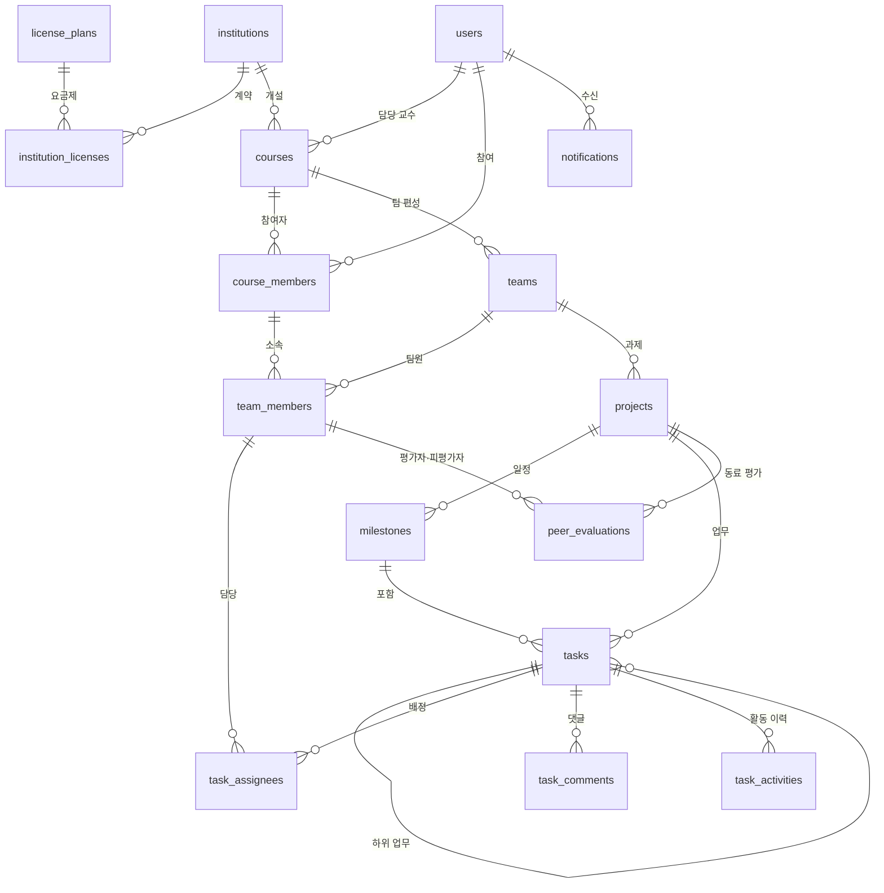

# 학기 프로젝트 1차 기획안 — 태스크허브 (TaskHub)

> 작성자: han-jaesun
> 사용 DBMS: PostgreSQL (`ai_database_book` 데이터베이스, `taskhub` 스키마 예정)
> 단계: 1차 기획안 (테이블 구성은 이후 단계에서 수정·보완 예정)

---

## 1. 프로젝트명

**태스크허브 (TaskHub) — 대학생 팀 프로젝트(팀플) 협업·기여도 관리 플랫폼**

---

## 2. 프로젝트 주제 및 비즈니스 모델

### 2-1. 주제

대학 수업의 조별과제(팀플)를 위한 협업 서비스입니다.
팀이 할 일을 나눠 담당자와 마감일을 정하고, 진행 상태를 함께 관리하며, **누가 어떤 일을 언제 끝냈는지를 기록해 팀원별 기여도 리포트를 자동으로 만들어 줍니다.**
교수와 조교는 수업 단위로 팀을 편성하고, 팀별 진행 상황과 기여도를 확인해 팀플 평가에 활용할 수 있습니다.

### 2-2. 기존 협업 도구와의 차별점

업무 생성, 담당자 지정, 상태 변경 같은 기본 기능은 Jira·Notion·Trello와 비슷합니다. 차별점은 **대상을 대학생 팀플로 좁히고, 기록된 데이터로 공정한 기여도를 보여 주는 것**입니다.

| 구분 | Jira·Notion·Trello | 태스크허브 |
| --- | --- | --- |
| 대상 | 회사 팀 | 대학 수업의 조별과제 팀 |
| 핵심 목적 | 일을 효율적으로 진행 | 일 진행 + 공정한 기여도 증빙 |
| 기여도 | 따로 계산해 주지 않음 | 업무 크기 점수, 마감 준수율, 논의 참여, 동료 평가를 함께 보여 주는 리포트 |
| 교수·조교 | 개념 없음 | 수업 단위로 팀을 편성하고 팀별 진행 상황과 기여도를 열람 |
| 도입 방식 | 팀원이 각자 가입하고 서로 설득해야 함 | 교수가 수업에 도입하면 학생은 초대 링크로 바로 참여 |
| 논의 기록 | 별도 메신저(슬랙·카톡)와 함께 써야 함 | 단톡방 대신 업무마다 댓글로 논의해, 결정 내용과 맥락이 그 업무에 남음 |
| 다른 팀과 비교 | 없음 | 수업 평균 진행률과 우리 팀 진행률을 비교해 볼 수 있음 (다른 팀의 세부 내용은 비공개) |
| 사용 난이도 | 기능이 많아 처음 쓰기 복잡함 | 팀플에 필요한 기능만 제공 |

> "카톡으로 하면 되지 않나?"라는 질문에 대한 답: 카톡은 대화는 남지만 업무 배정과 완료 시점은 남지 않아 무임승차가 생겨도 증명하기 어렵다. 또한 학생 개인이 아니라 교수가 수업 단위로 도입하는 구조라서, 학생이 따로 설득하지 않아도 자연스럽게 사용하게 된다.


| 수익원 | 방식 |
### 2-3. 비즈니스 모델 (수익 구조)

| 수익원 | 방식 | 데이터베이스와의 연결 |
| --- | --- | --- |
| 대학·학과 라이선스 (B2B) | 대학 또는 학과가 연 단위로 라이선스를 구매하고, 소속 교수가 수업에 자유롭게 도입한다. 요금은 이용 학생 수 기준. | 기관, 라이선스 요금제, 라이선스 기간을 관리한다. |
| 무료 체험 → 유료 전환 | 교수 개인은 수업 1개까지 무료로 사용하고, 여러 수업에 쓰려면 기관 라이선스로 전환한다. | 기관 라이선스가 없는 교수의 수업 수를 집계한다. |
| 평가 리포트 (상위 요금제) | 학기 말 팀별·개인별 기여도 리포트와 동료 평가 분석을 제공한다. | 활동 이력과 동료 평가 데이터를 집계해 제공한다. |

> 요금, 무료 범위 같은 구체적인 정책은 아직 확정하지 않았으며, 이후 요구사항 분석 단계에서 정한다.

---

## 3. 해결하고자 하는 문제

1. **무임승차와 불공정한 평가**: 누가 얼마나 기여했는지 기록이 없어서, 일을 안 한 팀원도 같은 점수를 받거나 동료 평가가 감정적으로 흐른다.
2. **흐지부지되는 역할 분담**: 단톡방에서 정한 역할이 메시지에 묻혀 "그거 누가 하기로 했지?"가 반복된다.
3. **마감 직전 몰아치기**: 중간 점검 없이 진행하다가 제출 직전에 일이 몰리고, 누가 늦었는지도 알 수 없다.
4. **교수·조교의 깜깜이 평가**: 교수와 조교는 최종 결과물만 보고 평가하게 되어, 팀 내부 기여도를 확인할 방법이 없다.

이 문제들은 모두 **"어떤 업무가, 누구에게, 언제까지, 어떤 상태로 바뀌었는가"를 정확히 기록하고 집계하는 문제**라서 관계형 데이터베이스로 해결하기에 적합하다.

---

## 4. 주요 사용자

| 사용자 | 설명 | 주로 하는 일 |
| --- | --- | --- |
| 학생 (팀원) | 수업을 듣고 팀플에 참여하는 학생 | 자기 업무 확인, 상태 변경, 댓글 작성, 동료 평가 |
| 학생 (팀장) | 팀을 이끄는 학생 | 과제 생성, 업무 나누기, 담당자·마감일 지정 |
| 교수 | 수업을 개설한 교수 | 수업 개설, 팀 편성, 팀별 진행률·기여도 확인 |
| 조교 | 수업 운영을 돕는 조교 | 팀별 진행 상황 모니터링, 마감 관리 |
| 기관 관리자 | 대학·학과의 서비스 담당자 | 라이선스 관리, 소속 교수 등록 |
| 플랫폼 운영자 | 서비스 운영 회사 | 요금제 관리, 기관별 사용량·매출 확인 |

---

## 5. 핵심 기능

| 번호 | 기능 | 설명 |
| --- | --- | --- |
| 1 | 기관·라이선스 관리 | 대학·학과 등록, 라이선스 요금제와 기간 관리 |
| 2 | 수업 개설·참여 | 교수가 수업을 개설하고, 학생·조교가 초대 링크로 참여 |
| 3 | 팀 편성 | 교수가 수업 안에서 팀(조)을 만들고 팀원과 팀장을 지정 |
| 4 | 팀 과제 관리 | 팀별 과제 생성 (한 팀이 중간·기말 등 여러 과제를 가질 수 있음) |
| 5 | 마일스톤 | 중간발표, 최종 제출 같은 주요 일정 설정 |
| 6 | 업무 관리 | 업무 생성, 마감일 설정, 상태 변경(할 일 → 진행 중 → 완료), 하위 업무로 쪼개기 |
| 7 | 담당자 배정 | 한 업무에 여러 담당자 지정 가능 |
| 8 | 업무별 댓글 | 단톡방 대신 업무 단위로 논의를 기록해, 나중에 "이건 왜 이렇게 정했지?"를 그 업무에서 바로 확인 |
| 9 | 활동 이력 | 누가 언제 어떤 업무의 상태를 바꿨는지 자동 기록 |
| 10 | 동료 평가 | 과제 종료 후 팀원끼리 서로 평가 |
| 11 | 기여도 리포트 | 팀원별 업무 점수, 마감 준수율, 논의 참여, 동료 평가를 한 화면에 (산정 방식은 아래 참고) |
| 12 | 교수 대시보드 | 수업 전체 팀의 진행률과 마감 지난 업무를 한눈에 확인 |
| 13 | 다른 팀과 진행률 비교 | 학생은 수업 전체 평균·상위 팀 진행률과 우리 팀 진행률을 비교 (다른 팀의 업무 내용과 팀원 정보는 보이지 않음) |

### 기여도 리포트 산정 방식

완료한 업무 **개수**만 세면 업무 크기가 달라도 똑같이 1개로 계산되고, 일을 잘게 쪼개 개수를 부풀릴 수 있으며, 업무로 잡히지 않는 기여(아이디어, 회의 진행)나 결과물의 질은 반영되지 않는다. 그래서 여러 지표를 함께 보여 준다.

| 지표 | 보완하는 문제 | 계산 방법 (예정) |
| --- | --- | --- |
| 업무 점수 | 큰 일과 작은 일의 차이 | 업무마다 크기 점수(`tasks.effort_points`, 예: 1·2·3점)를 정하고, 완료한 업무의 점수를 합산 |
| 공동 업무 분배 | 여러 명이 함께 한 업무의 중복 계산 | 업무 점수 ÷ 담당자 수로 나눠 각자에게 배분 |
| 마감 준수율 | 제때 했는지, 늦게 끝냈는지 | 완료 시점(`task_activities`)과 마감일(`tasks.due_date`) 비교 |
| 논의 참여 | 업무로 잡히지 않는 기여의 일부 | 업무별 댓글 수(`task_comments`) |
| 동료 평가 | 결과물의 질, 태도 등 숫자로 잡히지 않는 기여 | 팀원끼리 매긴 점수 평균(`peer_evaluations`) |

> **기여도 리포트는 점수를 자동으로 매기는 "판정"이 아니라, 교수와 팀원이 평가할 때 참고하는 "객관적 근거"이다.** 지금은 근거 없이 감으로 평가하는 문제를, 기록을 바탕으로 판단할 수 있게 하는 것이 목적이다.

---

## 6. 예상 테이블 구성 및 데이터 구조

### 6-1. 테이블 목록 (16개)

| 번호 | 테이블 | 한 행의 의미 | 주요 열 (예정) | PK | FK |
| ---: | --- | --- | --- | --- | --- |
| 1 | `users` | 가입한 사용자 한 명 (학생·교수·조교 공통) | email, name, created_at | id | – |
| 2 | `institutions` | 서비스를 도입한 대학·학과 하나 | name, type | id | – |
| 3 | `license_plans` | 라이선스 요금제 하나 | name, price_per_student, max_courses | id | – |
| 4 | `institution_licenses` | 한 기관의 라이선스 계약 기간 한 건 | started_at, ended_at, status | id | institution_id → institutions, plan_id → license_plans |
| 5 | `courses` | 개설된 수업 하나 | title, semester, invite_code | id | institution_id → institutions, professor_id → users |
| 6 | `course_members` | 한 사용자가 특정 수업에 참여한 기록 한 건 | role(교수·조교·학생), joined_at | id | course_id → courses, user_id → users |
| 7 | `teams` | 수업 안의 팀(조) 하나 | name | id | course_id → courses |
| 8 | `team_members` | 한 수업 참여자가 특정 팀에 소속된 기록 한 건 | role(팀장·팀원) | id | team_id → teams, member_id → course_members |
| 9 | `projects` | 한 팀의 과제 하나 (예: 기말 발표) | title, start_date, due_date, status | id | team_id → teams |
| 10 | `milestones` | 과제의 주요 일정 하나 (예: 중간발표) | title, due_date | id | project_id → projects |
| 11 | `tasks` | 업무 하나 | title, status, effort_points, due_date, completed_at | id | project_id → projects, milestone_id → milestones, parent_task_id → tasks(자기 참조), created_by → team_members |
| 12 | `task_assignees` | 한 업무에 한 팀원이 배정된 기록 한 건 | assigned_at | id | task_id → tasks, member_id → team_members |
| 13 | `task_comments` | 업무에 남긴 댓글 한 건 | content, created_at | id | task_id → tasks, author_id → team_members |
| 14 | `task_activities` | 업무의 변경 행위 한 번 (상태 변경, 담당자 변경 등) | activity_type, from_value, to_value, created_at | id | task_id → tasks, actor_id → team_members |
| 15 | `peer_evaluations` | 한 팀원이 다른 팀원을 평가한 기록 한 건 | score, comment, created_at | id | project_id → projects, evaluator_id → team_members, evaluatee_id → team_members |
| 16 | `notifications` | 사용자에게 보낸 알림 한 건 (배정, 마감 임박 등) | message, is_read, sent_at | id | user_id → users, task_id → tasks |

### 6-2. 관계 요약

- 한 사용자는 여러 수업에 참여할 수 있고, 한 수업에는 여러 사용자가 있다. → **N:M**이며 `course_members`가 연결 테이블이다. 같은 사람이 어떤 수업에서는 학생, 다른 수업에서는 조교일 수 있어서 역할(`role`)을 연결 테이블에 둔다.
- 한 수업은 여러 팀을 가지고, 팀 하나는 한 수업에만 속한다. (1:N)
- 팀원은 `users`가 아니라 `course_members`를 참조한다. **그 수업을 듣는 사람만 그 수업의 팀에 들어갈 수 있게** 하기 위해서다.
- 한 업무에는 여러 담당자가, 한 팀원에게는 여러 업무가 배정될 수 있다. → **N:M**이며 `task_assignees`로 표현한다.
- 업무는 상위 업무를 가질 수 있다. `tasks.parent_task_id`가 같은 `tasks` 테이블을 가리키는 **자기 참조** 관계이다. (예: "PPT 제작" 아래 "1~5쪽", "6~10쪽")
- 업무의 현재 상태는 `tasks.status`에, 바뀐 과정은 `task_activities`에 따로 남긴다. **현재 상태와 변경 이력을 분리**해야 "누가 언제 완료했는지"를 근거로 기여도를 계산할 수 있다.
- 동료 평가는 **같은 `team_members` 테이블을 두 번 참조**한다. (평가한 사람, 평가받은 사람)

### 6-3. ERD 초안



> 정식 ERD 표기(선택·필수 관계, 카디널리티 상세)는 2차 단계에서 다시 작성한다.

### 6-4. 내부 식별자와 업무 식별자

- 모든 테이블은 자동 증가 정수 `id`를 내부 식별자(PK)로 사용한다.
- 업무 식별자 후보: `users.email`, `courses.invite_code`(수업 초대 코드, UNIQUE 예정).
- 학번은 기관마다 체계가 다르고 학생이 아닌 사용자(교수·조교)도 있어서 FK로 쓰지 않는다. 다른 테이블은 항상 `id`로 연결한다.

### 6-5. 아직 확정하지 않은 정책

1. 동료 평가는 익명으로 할 것인가? 교수에게는 평가자를 공개할 것인가?
2. 업무 크기 점수(`effort_points`)는 누가 정하는가? (팀장 / 팀원 합의 / 교수가 기준 제시) 그리고 기여도 지표별 비중은 어떻게 둘 것인가?
3. 팀원이 수업을 중도 포기(드롭)하면 담당 업무와 활동 이력은 어떻게 처리하는가?
4. 팀장 외의 팀원도 업무를 만들고 배정할 수 있게 할 것인가?
5. 같은 업무에 같은 팀원이 중복 배정되지 않도록 (업무, 팀원) 조합을 UNIQUE로 할 것인가?
6. 다른 팀과의 비교를 학생에게 어디까지 보여 줄 것인가? (수업 평균만 / 순위까지 / 팀 이름 공개 여부) 비교가 과도한 경쟁이나 부담이 되지 않도록 교수가 공개 범위를 설정하게 할지 검토한다.

> 정해지지 않은 규칙은 억지로 제약조건으로 만들지 않고, 2~3차 단계에서 요구사항을 확정한 뒤 반영한다.

---

## 7. 데이터베이스 활용 계획 (예상 조회)

| 질문 | 사용할 SQL 개념 |
| --- | --- |
| 팀원별 업무 점수 합계는? (공동 업무는 점수 ÷ 담당자 수) | JOIN, 서브쿼리(업무별 담당자 수), SUM, GROUP BY |
| 팀원별 마감 준수율은? | JOIN(`task_activities`), 날짜 비교, 조건부 집계 |
| 배정된 업무를 하나도 완료하지 않은 팀원은? (무임승차 의심) | LEFT JOIN 또는 서브쿼리, IS NULL / NOT EXISTS |
| 수업 내 팀별 진행률 순위는? (교수 대시보드) | JOIN, GROUP BY, ORDER BY |
| 우리 팀 진행률은 수업 평균보다 높은가? (다른 팀과 비교) | 팀별 진행률 집계 결과를 서브쿼리로 감싸 AVG와 비교 |
| 특정 업무에서 어떤 논의가 있었는가? | WHERE, ORDER BY (업무별 댓글을 시간순 조회) |
| 마감일이 지났는데 완료되지 않은 업무는? | 날짜 비교, WHERE |
| 동료 평가 점수와 실제 완료 업무 수가 비슷한가? | 두 집계 결과를 서브쿼리로 비교 |
| 내가 담당한 미완료 업무를 마감일 순으로 보기 | JOIN, WHERE, ORDER BY |
| 하위 업무까지 포함한 업무 목록 | 자기 참조 JOIN (필요 시 재귀 쿼리) |

---

## 8. 애플리케이션 구현 계획

최종 단계에서는 데이터베이스와 연동되는 웹 애플리케이션으로 구현합니다.

### 8-1. 주요 화면 (예정)

| 화면 | 주요 내용 | 관련 테이블 | 활용 SQL |
| --- | --- | --- | --- |
| 팀 보드 | 상태별(할 일·진행 중·완료) 업무 목록, 담당자 필터 | tasks, task_assignees | JOIN, WHERE 필터, ORDER BY |
| 업무 상세 | 업무 정보, 하위 업무, 담당자, 댓글, 활동 이력, 상태 변경 | tasks, task_comments, task_activities | 자기 참조 JOIN, INSERT·UPDATE |
| 내 업무 | 내가 담당한 미완료 업무를 마감일 순으로 표시 | tasks, task_assignees | JOIN, WHERE, ORDER BY |
| 기여도 리포트 | 팀원별 업무 점수, 마감 준수율, 논의 참여, 동료 평가 | task_activities, task_assignees, task_comments, peer_evaluations | GROUP BY, 서브쿼리 |
| 교수 대시보드 | 수업 전체 팀의 진행률, 마감 지난 업무 | teams, projects, tasks | JOIN, GROUP BY |
| 진행률 비교 | 우리 팀 진행률 vs 수업 평균·상위 팀 | teams, projects, tasks | 집계 + 서브쿼리 |

### 8-2. 구현 범위

| 구분 | 내용 |
| --- | --- |
| 반드시 구현 | 팀 보드(검색·필터·정렬), 업무 추가·수정·삭제, 상태 변경과 활동 이력 기록, 업무별 댓글, 기여도 리포트, 교수 대시보드, 진행률 비교 |
| 데이터 구조로 설계 | 기관·라이선스, 알림, 동료 평가 입력 (테이블과 샘플 데이터는 만들고, 화면은 간단히 구현하거나 조회만 제공) |
| 제외 | 실제 로그인·회원가입(화면에서 사용자를 선택하는 방식으로 대체), 실시간 알림, 파일 첨부, 실제 결제 |

### 8-3. 기술 스택 (후보)

| 구분 | 후보 | 비고 |
| --- | --- | --- |
| 데이터베이스 | PostgreSQL | 수업 실습 환경(`ai_database_book`)에 `taskhub` 스키마로 구성 |
| 애플리케이션 | Python + Streamlit | 파이썬 하나로 화면과 DB 연결을 함께 만들 수 있어, 데이터베이스와 SQL에 집중하기 좋음 |
| 개발 도구 | Claude 등 생성형 AI, DBeaver, GitHub | AI로 코드 초안을 만들고, SQL은 DBeaver에서 직접 실행해 결과를 검증 |

> 기술 스택은 2차 고도화 단계에서 화면 구성과 함께 확정한다.

### 8-4. 생성형 AI 활용 원칙

- AI는 코드와 SQL의 **초안 작성과 검토**에 활용한다.
- AI가 만든 UPDATE·DELETE SQL은 실행 전에 같은 조건의 SELECT로 대상 행과 행 수를 먼저 확인한다. (Chapter 01·04 실습에서 익힌 방식)
- 테이블 구조와 제약조건은 본인이 먼저 설계하고, AI의 제안은 수용·수정·보류로 판단한 근거를 기록한다.

---

## 9. 향후 구현 계획

| 발표 | 시기 | 산출물 |
| --- | --- | --- |
| 1차 초안 | 10월 10일 | 이 기획안 |
| 2차 고도화 | 10월 말 | 요구사항 구체화, 미확정 정책 결정, 주요 화면 구성, ERD 초안, 기술 스택 확정 |
| 3차 분석·설계 | 11월 말 | 최종 ERD, 테이블 명세, 정규화, 제약조건(PK·FK·UNIQUE·NOT NULL·CHECK), 주요 SQL, 인덱스, 트랜잭션 |
| 4차 최종 | 12월 말 | 동작하는 웹 애플리케이션, 기능 시연, 핵심 SQL 설명, 회고 |

수업 내용과의 연결:

| 수업 단계 | 프로젝트 적용 |
| --- | --- |
| ERD·요구사항 (Chapter 05) | 정식 ERD 작성, 미확정 정책 결정 |
| 정규화·제약조건 (Chapter 06) | 중복 제거, 동료 평가 점수·업무 점수 범위 CHECK, 중복 배정 방지 UNIQUE 등 |
| 구현 (Chapter 07) | `taskhub` 스키마와 16개 테이블 생성, 가상 수업 2개 기준 샘플 데이터 입력 |
| 조회 (Chapter 08) | 기여도 리포트, 무임승차 의심 팀원 조회 SQL |
| 트랜잭션 (Chapter 09) | 업무 상태 변경 + 활동 이력 기록 + 담당자 알림을 하나의 트랜잭션으로 처리 |
| 인덱스·성능 (Chapter 10) | "내 업무", "팀별 업무 목록" 조회에 인덱스 적용과 성능 비교 |
| 권한 (Chapter 11) | 학생·교수·조교 역할별 조회 범위 구분 |
| 분석·Python (Chapter 12~14) | 학기 말 기여도 분석, Streamlit 화면 연동 |

---

## 10. 제출 파일 구성

```text
database-project/
├── README.md         ← 프로젝트 소개, 진행 상태, 변경 이력
└── 01_proposal/
    └── proposal.md   ← 이 문서 (ERD 초안은 Mermaid로 문서 안에 포함)
```

이후 단계에서 SQL 파일(`create_tables.sql`, `sample_data.sql`)과 ERD 이미지를 추가할 예정입니다.
